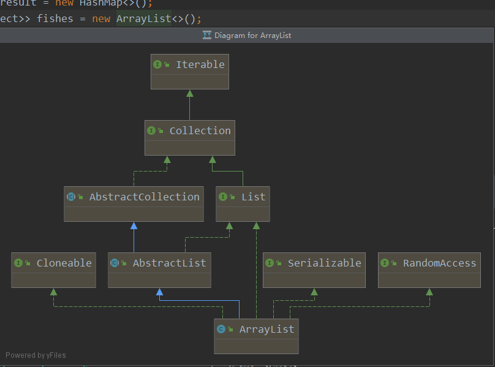

IntelliJ IDEA查看类层次结构快捷键
`Crtl + Alt + U`
`Crtl + Alt + Shift + U`
`Crtl + H`

查看`Diagram`图形 的类层次结构图
`Crtl + Alt + U`或 `Crtl + Alt + Shift + U`

手动步骤，右键需要查看的类 -> `Diagrams` -> `Show Diagram Popup`

然后就可以看到类的具体层次结构了

